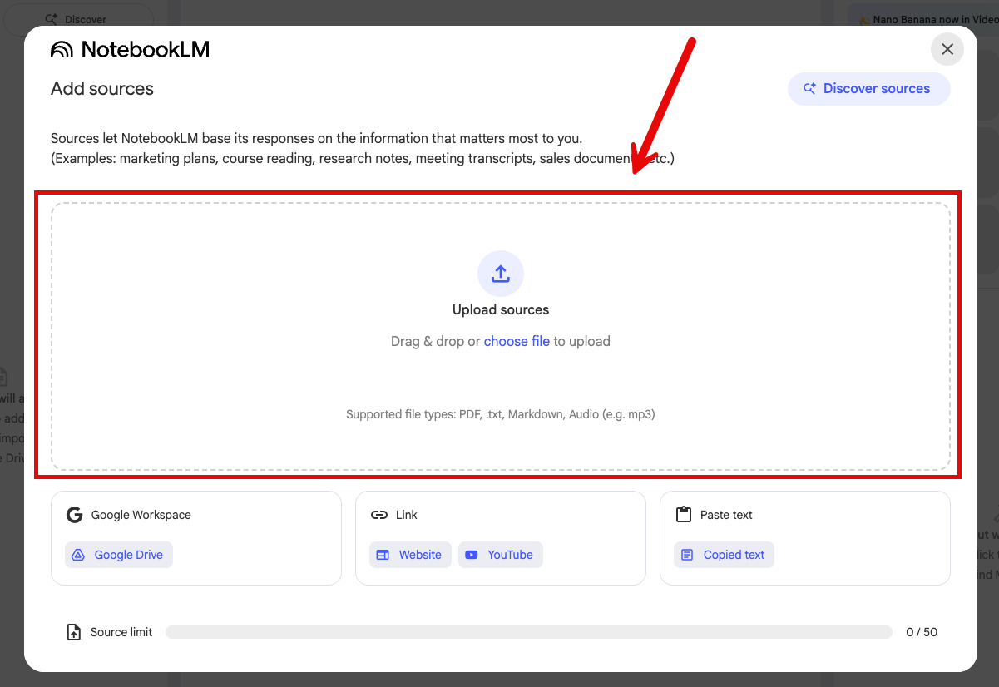
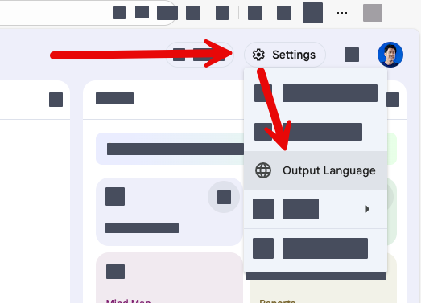
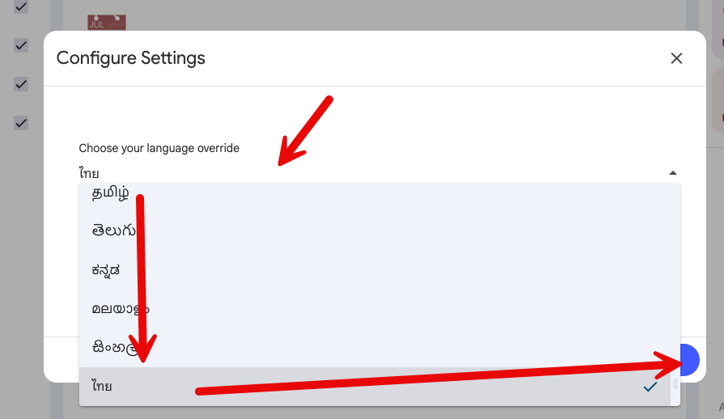
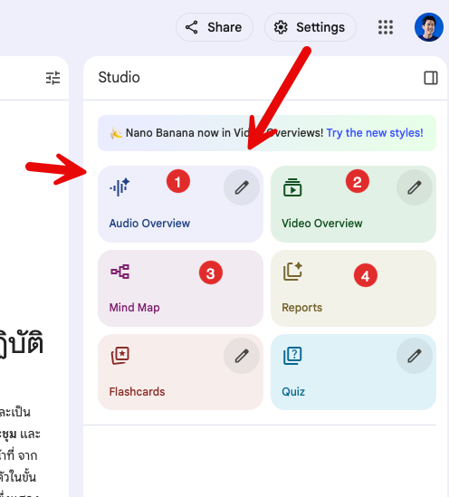

# Part 3-2: สร้าง AI Knowledge Hub ด้วย Notebook LM

## ขั้นตอนที่ 1: เตรียมและอัปโหลดเอกสาร
ไปที่ [NotebookLM](https://notebooklm.google.com/) และเข้าสู่ระบบด้วย Gmail ส่วนตัวของพวกเรา


## ขั้นตอนที่ 2: สร้าง Knowledge Hub

1. คลิกที่ปุ่ม "สร้างโน้ตบุ๊คใหม่" (Create New Notebook)


2. ตั้งชื่อโน้ตบุ๊คว่า "ผู้ช่วยติดตามโครงการ"
3. ในหน้าต่าง Add Source ให้เลือก Upload Sources และเลือกไฟล์เอกสาร PDF ที่อยู่ใน folder ของ Google Drive นี้ (สามารถ Download มาก่อนได้)
   1.  https://drive.google.com/drive/folders/1TOckWj2akfb5PKcc6w9AV4n4vj2BpTwc?usp=sharing 
4. คลิกที่ปุ่ม "Upload" เพื่ออัปโหลดไฟล์ PDF
   


5. รอให้ Notebook LM ดึงข้อมูลจากไฟล์ PDF และประมวลผล เมื่อประมวลผลเสร็จสิ้น ข้อมูลจากเอกสารจะถูกเพิ่มเข้าไปในโน้ตบุ๊ค

## ขั้นตอนที่ 3: ตั้งค่าภาษา

1. คลิกที่ไอคอนรูปเฟือง (Settings) ที่มุมขวาบนของหน้าจอโน้ตบุ๊ค



2. ในเมนู Configure Settings ให้เลือก Choose your language override เป็น "ไทย" (Thai) และคลิกปุ่ม "Save"



## ขั้นตอนที่ 4: ใช้งาน Studio 

1. จากหน้าจอโน้ตบุ๊ค สังเกตด้านขวาจะมีส่วนที่เรียกว่ Studio 
2. คลิกเลือก Studio เพื่อเปิดใช้งานฟีเจอร์ต่อไปนี้
   1. Audio Overview
   2. Video Overview
   3. Mind Map
   4. Report



3. ปล่อยให้ระบบทำงาน เราจะกลับมาดูกันทีหลัง

## ขั้นตอนที่ 5: ใช้ Notebook LM เพื่อค้นหาความรู้

ทดสอบ prompt สั่งงานด้วยคำสั่งต่อไปนี้ และสังเกตผลลัพธ์ที่ได้

### Prompt 1

```
ใครเข้าประชุมบ่อยที่สุด และใครเข้าประชุมน้อยที่สุด
```

### Prompt 2

```
โปรดสรุปสาระสำคัญของเอกสารนี้ให้สั้น ใน 5 ข้อ โดยให้เน้น “ประเด็นที่ต้องติดตาม/ดำเนินการ” แล้วจัดทำเป็นตาราง 2 คอลัมน์: คอลัมน์แรก = ประเด็น, คอลัมน์ที่สอง = ผู้รับผิดชอบ/กำหนดเวลา
```

### Prompt 3

```
ช่วยจัดลำดับความสำคัญของประเด็นทั้ง 5 ข้อ โดยอ้างอิงจากผลกระทบต่อทีมงานโดยรวม
```

### Prompt 4

```
เสนอแนะหัวข้อการประชุมครั้งถัดไป และแนะนำผู้ที่ต้องเข้าร่วมประชุม
```

## ขั้นตอนที่ 6: ตรวจสอบผลลัพธ์จาก Studio

กลับไปที่ส่วน Studio ที่เราเปิดไว้ก่อนหน้านี้ และตรวจสอบผลลัพธ์จากฟีเจอร์ต่างๆ ดังนี้
1. Audio Overview: ฟังสรุปเนื้อหาสำคัญจากเอกสารในรูปแบบเสียง
2. Video Overview: ชมวิดีโอสรุปเนื้อหาสำคัญจากเอกสาร
3. Mind Map: ดูแผนผังความคิด
4. Report: ตรวจสอบรายงานสรุปเนื้อหาสำคัญจากเอกสาร
