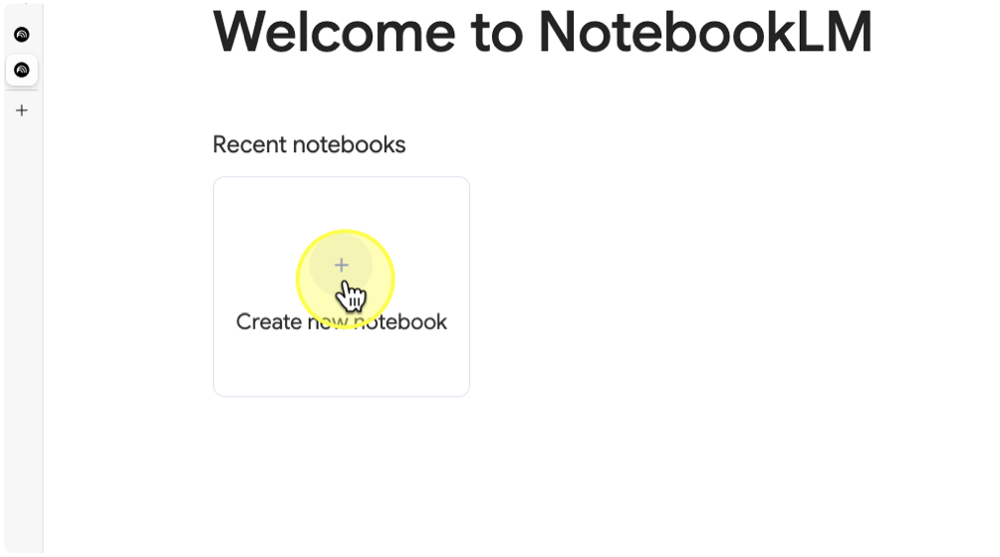

# Part 3-2: สร้าง AI Knowledge Hub ด้วย Notebook LM

## ขั้นตอนที่ 1: เตรียมและอัปโหลดเอกสาร
ไปที่ [NotebookLM](https://notebooklm.google.com/) และเข้าสู่ระบบด้วย Gmail ส่วนตัวของพวกเรา


## ขั้นตอนที่ 2: สร้าง Knowledge Hub

1. คลิกที่ปุ่ม "สร้างโน้ตบุ๊คใหม่" (Create New Notebook)



2. ตั้งชื่อโน้ตบุ๊คว่า "ผู้ช่วยติดตามโครงการ"
3. ในหน้าต่าง Add Source ให้คลิก Link > Website


4. Copy และวางลิงก์ [https://www.finnomena.com/planet46/social-security-privileges/](https://www.finnomena.com/planet46/social-security-privileges/) ลงในช่อง URL แล้วคลิกปุ่ม "Insert"


5. URL Website ดังกล่าวจะแสดงขึ้นมาในรายการ Source รอให้ Notebook LM ดึงข้อมูลจากเว็บไซต์และประมวลผล เมื่อประมวลผลเสร็จสิ้น ข้อมูลจากเว็บไซต์จะถูกเพิ่มเข้าไปในโน้ตบุ๊ค


6. NotebookLM จะตั้งชื่อตัวเอง เราสามารถคลิกเพื่อแก้ไขได้ ในที่นี้ตั้งชื่อว่า "Social Security Privileges"


7. กดปุ่ม Add เพื่อเพิ่มแหล่งข้อมูลใหม่เข้าไปในโน้ตบุ๊ค


8. กด Link > Youtube


9. Copy และวางลิงก์ [https://www.youtube.com/watch?v=Dn9dao03z3I](https://www.youtube.com/watch?v=Dn9dao03z3I) ลงในช่อง URL แล้วคลิกปุ่ม "Insert"  

10. ตรวจสอบให้แน่ใจว่าแหล่งข้อมูล YouTube ถูกเพิ่มเข้าไปในโน้ตบุ๊คแล้ว

## ขั้นตอนที่ 3: ใช้ Notebook LM เพื่อค้นหาความรู้

ทดสอบ prompt สั่งงานด้วยคำสั่งต่อไปนี้ และสังเกตผลลัพธ์ที่ได้

### Prompt 1

```
สิทธิประโยชน์ทันตกรรมและการจำกัดวงเงินของผู้ประกันตนมาตรา 33 มีรายละเอียดอย่างไรบ้าง
```

### Prompt 2

```
เปรียบเทียบความแตกต่างด้านการได้รับเงินทดแทนการขาดรายได้ กรณีเจ็บป่วยสำหรับผู้ประกันตนมาตรา 33 กับมาตรา 39 (ตามฐานเงินสมทบที่กำหนด) ว่ามีอัตราและฐานการคำนวณที่แตกต่างกันอย่างไร
```

### Prompt 3

```
ผู้ประกันตนมาตรา 33 ที่ประสบอุบัติเหตุหรือเจ็บป่วยฉุกเฉินวิกฤต สามารถเข้ารับการรักษาที่สถานพยาบาลใกล้เคียงได้ทุกแห่งโดยไม่ต้องสำรองจ่ายได้หรือไม่ และระยะเวลาที่ได้รับสิทธิโดยรวมวันหยุดราชการคือเท่าใด
```
