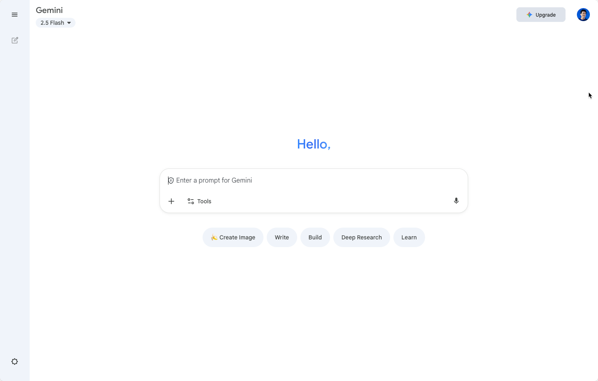
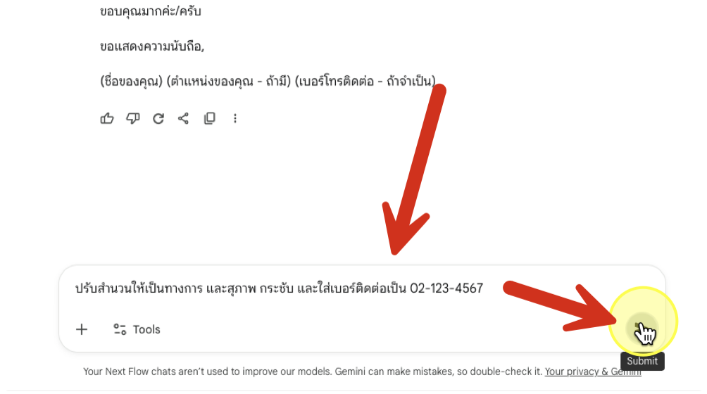

# Part 2-2: เริ่มต้นใช้ Google Gemini Chat


## 1. ขั้นตอนการเข้าใช้งาน

1. เปิด link [https://gemini.google.com/app](https://gemini.google.com/app)
2. Login ด้วย Google account ส่วนตัว
3. เราจะเห็นเข้ามาที่ Gemini ตามภาพ



## Feature 1: ร่าง Email ด้วย Gemini Chat

#### 1. สังเกตเห็นช่อง  "Enter a prompt for Gemini|" ซึ่งเป็นจุดที่ทำให้เราสามารถส่งข้อมูลได้


#### 2. คัดลอกข้อความตัวอย่างมาวางไว้ในช่อง และกด Enter

```
ร่างอีเมลล์ถึงพวกเราสมศรี เรื่องการขอนัดคุยเรื่องงบประมาณโครงการสินค้าใหม่ โดยอยากนัดเวลา 10.00 น.
```


#### 3. ตรวจสอบผลลัพธ์


ตรวจสอบผลลัพธ์ 

#### 4. คัดลอกข้อความตัวอย่างชุดถัดมา มาวางไว้ในช่อง prompt และกด Send เพื่อส่งคำสั่ง

```
ปรับสำนวนให้เป็นทางการ และสุภาพ กระชับ และใส่เบอร์ติดต่อเป็น 02-123-4567
```




ตรวจสอบผลลัพธ์ และสามารถพิมพ์ส่งคำสั่งเพิ่มเติมเพื่อปรับแต่งแบบร่างอีเมลล์ได้

#### 5. เมื่อพอใจแล้ว สามารถกดปุ่ม Share ด้านล่างข้อความผลลัพธ์ เพื่อใช้งานอื่นๆ ได้

เช่น
- แชร์บทสนทนา
- สร้างเอกสาร Google Docs
- ร่างอีเมลล์ใหม่ใน Gmail


## Feature 2: Chat History 

1. จากหน้าจอปัจจุบันให้สังเกตด้านข้างที่มีการแสดงประวัติการสนทนา ซึ่งเราสามารถคลิกเพื่อดูรายการของการสนทนากับ Gemini ก่อนหน้าได้


2. กดปุ่มสร้าง Chat ใหม่ด้านบน เพื่อขึ้นการสนทนาใหม่


3. คัดลอกข้อความด้่านล่างไปใส่ในช่อง Chat โดยให้แทนที่ [องค์กร] ด้วยชื่อองค์กรที่เราสนใจหรือทำงานอยู่

```
หาข่าว [องค์กร] ที่สำคัญในปี 2025
```

4. ตรวจสอบผลลัพธ์ 

## Feature 3: Working with File

1. ดาวน์โหลดไฟล์ PDF จาก [ที่นี่](https://drive.google.com/file/d/1oaNOKs8VQ7LgU65CPq49kzqmD7Ph9Ftt/view?usp=sharing) หรือใช้ file ที่ได้จาก zip ที่ดาวน์โหลดตอนแรก
2. ขึ้นห้องแชทใหม่
3. จากกล่องข้อความแชท ให้กดปุ่ม "+" ด้านล่างซ้าย


4. และเลือก **Upload images or files**


5. เลือกอัพโหลดไฟล์ **Expenses_Policy.pdf** และตรวจสอบผลลัพธ์ที่ได้


6. ลองสังเกตในผลลัพธ์ที่ได้ จะเห็นว่า Gemini มีการใส่ไอคอนรูป โซ่ (link) เล็กๆ ไว้ตามข้อความที่เกี่ยวข้องกับไฟล์ที่เราอัพโหลดเข้าไป 


7. ให้ลองคลิกเพื่อเปิดดูเนื้อหาภายในไฟล์อ้างอิง ให้สังเกตว่า


8. เลื่อนลงมาด้านล่างของผลลัพธ์ จะเห็นว่ามีส่วนของ source ที่สามารถเปิดดูการอ้างอิงข้อมูลได้เช่นกัน


### ท้าให้ลอง

1. สร้างห้องแชทใหม่
2. อัพโหลดไฟล์ PDF เดียวกันนี้เข้าไปใหม่
3. พิมพ์ข้อความต่อจากชื่อไฟล์ที่อัพโหลดตามด้านล่าง และตรวจสอบผลลัพธ์ที่ได้

```
งบอะไรเบิกได้เยอะสุด เบิกเป็นเงินบาทได้เท่าไหร่
```

> เคล็ดลับ: ในที่นี้ถ้าเรามีไฟล์บน Google Drive จะเห็นว่า เราสามารถกดเปิดไฟล์จาก Google Drive ได้ด้วย

## Feature 4: แก้ไขรูปภาพด้วย Gemini Chat


1. สร้างห้องแชทใหม่
2. อัพโหลดไฟล์รูปภาพ **01-feature-4.jpg** เข้าไปในห้องแชท
3. พิมพ์หรือคัดลอกคำสั่งด้านล่างไปใส่ในช่อง Chat และกด enter พร้อมสังเกตผลลัพธ์

```
นำป้ายข้อความด้านบนออก
```

4. พิมพ์หรือคัดลอกคำสั่งด้านล่างไปใส่ในช่อง Chat และกด enter พร้อมสังเกตผลลัพธ์

```
เปลี่ยนชุดคนตัดริบบิ้นเป็นชุดไทยโบราณสมัยสมเด็จพระเจ้าตากสิน
```

5. ตรวจสอบผลลัพธ์