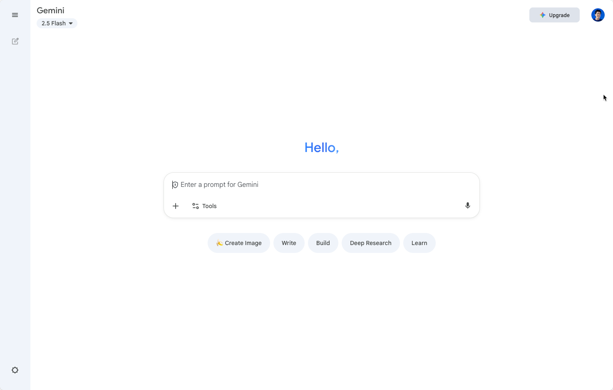
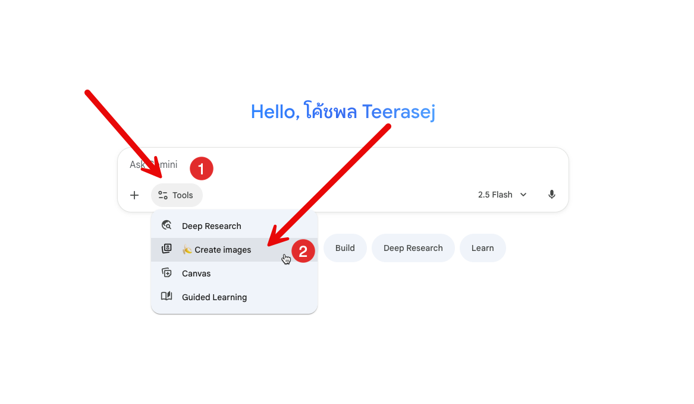

# Part 2-3: รูปภาพและ Google Gemini


## 1. ขั้นตอนการเข้าใช้งาน

1. เปิด link [https://gemini.google.com/app](https://gemini.google.com/app)
2. Login ด้วย Google account ส่วนตัว
3. เราจะเห็นเข้ามาที่ Gemini ตามภาพ



4. กดเลือกปุ่ม Tools ในห้องแชท และเลือก "Generate Image"



## Exercise 1: Warm-up (เริ่มต้นง่ายๆ) - "ความมั่นคง"
**เป้าหมาย:** ทำความคุ้นเคยกับการสั่งงานขั้นพื้นฐาน และดูว่า Gemini ตีความคำที่เป็นนามธรรม (Abstract) อย่างไร

ในงานประกันสังคม หัวใจสำคัญคือ "ความมั่นคง" (Security) และ "ความอุ่นใจ" (Peace of mind)

### คำสั่ง (Prompt) ที่จะลอง:

```
ครอบครัวที่อบอุ่นและมีความสุข กำลังยิ้ม
```

สังเกต: ภาพที่ได้จะสื่อถึงความสุขทั่วไป

```
ภาพแนวคิด (Conceptual image), โล่ที่แข็งแกร่งกำลังปกป้องครอบครัวครอบครัวหนึ่ง
```

สังเกต: ภาพนี้จะเริ่มสื่อถึง "การปกป้อง" ซึ่งใกล้เคียงกับภารกิจของ สปส. มากขึ้น

คำถามชวนคิด: ถ้าเราอยากให้ "โล่" นั้นดูเกี่ยวข้องกับ "การเงิน" หรือ "สุขภาพ" เราควรจะเพิ่มคำว่าอะไรลงไปใน Prompt?

## Exercise 2: โจทย์จริงสำหรับ Social Media - "สิทธิประโยชน์ที่จับต้องได้"
**เป้าหมาย:** สร้างภาพที่ชัดเจน สื่อสารสิทธิประโยชน์เรื่องใดเรื่องหนึ่งโดยเฉพาะ สำหรับใช้ประกอบโพสต์ Facebook หรือ Website

สถานการณ์: เราต้องการสื่อสารเรื่อง "สิทธิการรักษาพยาบาล"

คำสั่ง (Prompt) ที่จะลอง:

Prompt ที่ไม่ดี (กว้างไป):
```
คนป่วยไปโรงพยาบาล
```

ผลลัพธ์ที่คาดเดา: อาจได้ภาพที่ดูน่ากลัว ป่วยหนัก หรือดูเศร้า

Prompt ที่ดี (เจาะจงและสื่อสารเชิงบวก):
```
ภาพสไตล์เวกเตอร์ (vector), ผู้ประกันตนกำลังยื่นบัตรประกันสังคมให้เจ้าหน้าที่โรงพยาบาลด้วยรอยยิ้ม, เคาน์เตอร์ต้อนรับที่ดูสะอาดและเป็นมิตร, พื้นหลังสีฟ้าอ่อน
```

คำถามชวนคิด:

ทำไมเราถึงระบุว่า "สไตล์เวกเตอร์"? (ตอบ: เพราะเหมาะกับการทำกราฟิก, สะอาดตา, ไม่ดูจริงจังเท่าภาพถ่าย)

การเพิ่มคำว่า "ด้วยรอยยิ้ม" และ "เป็นมิตร" ส่งผลต่อภาพรวมอย่างไร?

ลองทำเอง: ลองเปลี่ยนโจทย์เป็น "สิทธิประโยชน์กรณีคลอดบุตร" หรือ "สิทธิประโยชน์กรณีว่างงาน" โดยใช้โครงสร้าง Prompt ที่ดี (ระบุ สไตล์, อารมณ์, และการกระทำ)

## Exercise 3: สร้างภาพสำหรับกลุ่มเป้าหมายที่ต่างกัน
**เป้าหมาย:** ฝึกการปรับ "สไตล์" ของภาพ ให้เข้ากับกลุ่มเป้าหมายที่แตกต่างกัน (เช่น ม.33, ม.39, ม.40)

สถานการณ์: เราต้องการโปรโมตให้คนมาสมัครเป็นผู้ประกันตน

### คำสั่ง (Prompt) สำหรับกลุ่มเป้าหมาย:

#### กลุ่มพนักงานออฟฟิศ (ม.33):
```
ภาพถ่ายสมจริง (photorealistic), กลุ่มคนทำงานออฟฟิศวัยหนุ่มสาว แต่งตัวดูดี กำลังยืนคุยกันอย่างมีความสุขในออฟฟิศสมัยใหม่, แสงสว่างธรรมชาติ
```

#### กลุ่มฟรีแลนซ์/อาชีพอิสระ (ม.39 / ม.40):
```
ภาพ 3D render สไตล์มินิมอล, ฟรีแลนซ์กำลังนั่งทำงานหน้าคอมพิวเตอร์อย่างมีความสุขในร้านกาแฟ, มีไอคอนรูป 'โล่' หรือ 'เงินออม' เล็กๆ ลอยอยู่ข้างๆ เพื่อสื่อถึงความมั่นคง
```

#### กลุ่มผู้สูงอายุ (รับบำนาญ):
```
ภาพถ่าย, ผู้สูงอายุคู่หนึ่งกำลังยิ้มอย่างมีความสุข, นั่งพักผ่อนในสวนที่บ้าน, แสงแดดอ่อนๆ ยามเช้า, ดูผ่อนคลายและไร้กังวล
```

คำถามชวนคิด: เราจะสร้างภาพเพื่อสื่อสารกับ "กลุ่มแรงงานในโรงงาน" หรือ "กลุ่มผู้ประกอบการ" อย่างไรให้แตกต่าง?

## Exercise 4: การทำภาพ Infographic - "แปลงข้อมูลให้เป็นภาพ"
**เป้าหมาย:** สร้าง "ส่วนประกอบ" (Element) สำหรับใช้ในการทำ Infographic หรือคู่มือ "How-to"

สถานการณ์: เราต้องการภาพประกอบหัวข้อ "ขั้นตอนการยื่นขอรับประโยชน์ทดแทน"

#### คำสั่ง (Prompt) ที่จะลอง:

Icon/Element:
```
ไอคอนเวกเตอร์ (vector icon), รูปเอกสาร, สไตล์มินิมอล, พื้นหลังสีขาว, ไม่มีเงา
```
```
ไอคอนเวกเตอร์, รูปมือถือที่เปิดแอป SSO Connect, สไตล์มินิมอล, พื้นหลังสีขาว
```

ภาพประกอบขั้นตอน:
```
ภาพวาดลายเส้น (line drawing), คนกำลังกกรอกเอกสารบนโต๊ะ, มองจากมุมบน, สะอาดตา
```
```
ภาพสไตล์ Flat design, คนกำลังยื่นเอกสารให้เจ้าหน้าที่ที่เคาน์เตอร์, เจ้าหน้าที่ยิ้มรับ
```

> **Pro-Tip:** การสั่งให้ "พื้นหลังสีขาว" (white background) หรือ "ตัดวัตถุ (isolated)" จะช่วยให้คุณนำภาพไปวางบนดีไซน์อื่นได้ง่ายขึ้นมาก
